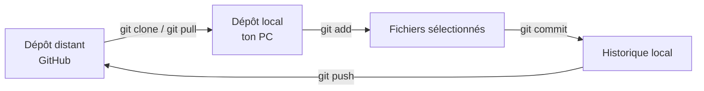

# 24.09 - Les conditions

Une condition permet d'exécuter un bloc de code **seulement si** une expression est vraie.

```c
if (cpt > 0) {
    printf("Le compteur est positif\n");
}
else if (cpt < -10) {
    printf("Le compteur est plus petit que -10\n");
}
else if (cpt < 0) {
    printf("Le compteur est négatif\n");
}
else {
    printf("Le compteur vaut 0\n");
}
```

- `if` : le bloc est exécuté si la condition est vraie.
- `else if` : testé **seulement si** les conditions précédentes étaient fausses. On peut en mettre plusieurs.
- `else` : exécuté si **aucune** condition n'était vraie. Il est facultatif.

Les conditions sont testées dans l'ordre : dès qu'une est vraie, son bloc est exécuté et les suivantes sont ignorées.

> [!NOTE]
> En C, une valeur égale à `0` est **fausse**, toute autre valeur est **vraie**. `if (3)` est donc toujours exécuté.

## Opérateurs de comparaison

Le résultat d'une comparaison vaut `1` (vrai) ou `0` (faux).

| Opérateur | Signification |
|---|---|
| `==` | égal |
| `!=` | différent |
| `<` | plus petit |
| `<=` | plus petit ou égal |
| `>` | plus grand |
| `>=` | plus grand ou égal |

> [!WARNING]
> `=` est une **affectation**, `==` est une **comparaison**. `if (a = 5)` modifie `a` et est toujours vrai !

On combine plusieurs conditions avec les opérateurs logiques : `&&` (ET), `||` (OU) et `!` (NON).

```c
if (cpt > 0 && condition1) {
    printf("Le compteur est positif et condition1 est vraie\n");
}

if (!condition1) { // équivalent à : condition1 == false
    printf("condition1 est fausse\n");
}
```

## Le type `bool`

On peut stocker le résultat d'une condition dans une variable de type `bool`, qui vaut `true` ou `false`.
Pour l'utiliser, il faut inclure `stdbool.h`.

```c
#include <stdbool.h>

bool condition1 = false;    // false vaut 0, true vaut 1
bool est_positif = cpt > 0; // résultat d'une comparaison

if (est_positif) {
    printf("Le compteur est positif\n");
}
```

## Conventions de nommage

| Convention | Exemple |
|---|---|
| snake_case | `cpt_machine` |
| camelCase | `cptMachine` |
| PascalCase | `CptMachine` |

Le C est sensible à la casse : ces trois noms désignent trois variables **différentes**. Choisir une convention et s'y tenir.

Voir [condition.c](condition.c) pour l'exemple complet.

## Exercices

- [Exercices sur les conditions](https://github.com/tony-maulaz/info1-exercices/blob/main/ex20-conditions.md)

---

## Questions

**1. Quelle est la différence entre `if`, `else if` et `else` ?**

**2. Si plusieurs conditions d'une suite `if` / `else if` sont vraies, lesquelles sont exécutées ?**

**3. Quelle est la différence entre `=` et `==` ?**

**4. Que vaut l'expression `5 > 3` ? Et `5 == 3` ?**

**5. Le bloc de `if (7 / 9)` est-il exécuté ? Pourquoi ?**

**6. Écrire une condition qui est vraie si `x` est compris entre 10 et 20 (inclus).**

**7. Que faut-il inclure pour utiliser le type `bool` ? Quelles valeurs peut-il prendre ?**


# 23.09 - Variables et types

Une **déclaration** demande un **type** et un **nom** : `int compteur;`

On **initialise** la variable avec `=`. Sans initialisation, sa valeur est **inconnue**.

```c
int compteur;        // valeur inconnue
double force = 1.2e3; // déclaration + initialisation
```

## Les types de base

| Type | Taille | Contenu | `printf` |
|---|---|---|---|
| `int` | 32 bits signés | entier | `%d` |
| `double` | 64 bits | nombre à virgule | `%lf` |
| `char` | 8 bits signés | caractère (= un entier, code ASCII) | `%c` ou `%d` |

> [!NOTE]
> Un `char` s'écrit avec des guillemets **simples** : `'A'` et non `"A"`.

## Dépassement de capacité

Si le résultat ne tient pas dans le type, les bits en trop sont perdus et la valeur
obtenue est fausse — souvent négative, car le bit de poids fort devient le bit de signe.

```c
char c = 100;
printf("%d\n", (char)(2 * c)); // affiche -56 et non 200
```

Un `char` signé ne va que de -128 à 127. Voir [variable.c](variable.c) pour les exemples complets.

---

## Les nombres et les bases
- nombre : https://heig-tin-info.github.io/handout/content/datatype.html#les-nombres-reels
- binaire : https://heig-tin-info.github.io/handout/content/numeration.html#systeme-binaire
- hexadécimal : https://heig-tin-info.github.io/handout/content/numeration.html#systeme-hexadecimal
- complement à 2 : https://heig-tin-info.github.io/handout/content/numeration.html#complement-a-deux

- ASCII : https://heig-tin-info.github.io/handout/content/ascii.html


## Questions

**1. Que faut-il indiquer pour déclarer une variable ?**

**2. Que vaut une variable déclarée mais non initialisée ?**

**3. Quels sont les trois types de base vus au cours, et combien de bits occupent-ils ?**

**4. Quel format `printf` utilise-t-on pour un `int`, un `double`, un `char` ?**

**5. Quelle est la différence entre `'A'` et `"A"` ?**

**6. Que vaut `'g' - 'a' + 1` ? Pourquoi peut-on faire des calculs avec des `char` ?**

**7. Un `char` vaut 120. Que donne `2 * 120` stocké dans un `char` ? Expliquer le résultat.**

**8. Quelle est la plage de valeurs d'un `char` signé ?**


# 22.09 - Numération

Dans l'ordinateur, tout est stocké sous forme de bits. Une même suite de bits peut représenter des valeurs différentes selon la façon dont on l'interprète. Pour savoir comment une valeur est stockée, il faut connaître :

- le **nombre de bits** utilisés (8, 16, 32, 64…) ;
- si la valeur est **signée** ou **non signée**.

> [!NOTE]
> Par exemple, `1111 1111` sur 8 bits vaut **255** en non signé, mais **-1** en signé.

## Complément à 2

Pour représenter les nombres négatifs, on utilise le **complément à 2**. Pour passer d'un nombre positif à son opposé (et inversement) :

1. inverser tous les bits (complément à 1) ;
2. ajouter 1.

Exemple sur 8 bits : `5` = `0000 0101` → inversion `1111 1010` → +1 → `1111 1011` = `-5`.

Sur *n* bits signés, le bit de poids fort indique le signe : `0` pour positif, `1` pour négatif. La plage représentable va de -2^(n-1) à 2^(n-1) - 1.

## À retenir

Vous devez savoir :

- changer de base entre le binaire (2), le décimal (10) et l'hexadécimal (16) ;
- interpréter un nombre binaire, signé ou non signé, en connaissant le nombre de bits ;
- additionner et soustraire deux nombres binaires.

---

## Questions

**1. Convertir 37 en binaire, puis en hexadécimal.**

**2. Convertir `0x2F` en base 10, puis en binaire.**

**3. Donner la valeur en base 10 de `1101` sachant que le nombre est codé sur 4 bits non signés. Même question si le nombre est codé sur 4 bits signés.**

**4. Qu'est-ce que le complément à 2 ? Comment obtient-on l'opposé d'un nombre binaire ?**

**5. Représenter -5 sur 8 bits en complément à 2.**

**6. Quelle est la plage de valeurs représentables sur 8 bits non signés ? Sur 8 bits signés ?**

**7. Calculer `0101 + 0011` en binaire sur 4 bits. Quel est le résultat en base 10 ?**

**8. Calculer `0110 - 0011` en binaire sur 4 bits en utilisant le complément à 2.**

**9. Que se passe-t-il si l'on additionne `1000` et `1000` sur 4 bits non signés ? Comment s'appelle ce phénomène ?**

**10. Pourquoi est-il indispensable de connaître le nombre de bits et le caractère signé ou non signé pour interpréter une valeur stockée en mémoire ?**

# 17.09 - Git et Workflow labo
Git est un outil qui **garde l'historique** du code. Il permet de revenir en arrière, de voir ce qui a changé et de partager le travail.

- **Dépôt (repository, « repo »)** : un dossier de projet suivi par Git.
- **Dépôt distant** : la copie du repo sur un serveur (GitHub, GitLab…).
- **Dépôt local** : une copie du repo sur l'ordinateur.
- **Commit** : une « photo » du projet à un moment donné.

## Les commandes essentielles

| Commande | À quoi ça sert |
|---|---|
| `git clone <url>` | Copier un dépôt distant sur l'ordinateur (une seule fois, au début) |
| `git status` | Voir l'état des fichiers : modifiés, sélectionnés pour le commit, non suivis |
| `git add <fichier>` | Sélectionner un fichier pour le prochain commit (`git add .` = tous les fichiers modifiés) |
| `git commit -m "message"` | Enregistrer les fichiers sélectionnés dans l'historique **local** |
| `git push` | Envoyer les commits locaux vers le dépôt distant |
| `git pull` | Récupérer les nouveautés du dépôt distant sur l'ordinateur |
| `git log` | Afficher l'historique des commits |

> [!WARNING]
> Un `commit` reste **sur l'ordinateur**. Tant que la commande `git push` n'as pas été faite, rien n'est envoyé sur le serveur.

## Le flux de travail pour les labos

```bash
git clone <url-du-repo>
cd <nom-du-repo>

(git add .)
git commit -am "Ajout de la fonction moyenne()"

git push
```



### Bonnes pratiques

- Faire des commits **petits et fréquents**, pas un seul gros commit à la fin.
- Écrire des messages **clairs** : `Correction du calcul de la moyenne` plutôt que `modif` ou `truc`.
- Toujours faire `git push` avant de quitter la salle de labo.

---

## Questions

**1. Qu'est-ce qu'un dépôt (repository) Git ?**

**2. Comment récupère-t-on un dépôt qui se trouve sur GitHub ?**

**3. Que fait la commande `git add .` ?**

**4. Qu'est-ce qu'un commit ?**

**5. J'ai fait un commit. Est-ce que l'on peut voir mon travail sur GitHub ? Pourquoi ?**

**6. Quelle est la différence entre `git push` et `git pull` ?**

**7. Comment savoir quels fichiers ont été modifiés depuis le dernier commit ?**

**9. J'ai travaillé sur le labo à la maison et fait un `push`. De retour à l'école, que dois-je faire avant de continuer ?**


# 16.09 - Introduction au cours
- Comme outils, on utilisera : 
  - Cyberlearn : https://cyberlearn.hes-so.ch/course/view.php?id=26109
  - GitHub : https://github.com/Info1-MI-2026
  - Teams : r1oyk10

### Les commandes de bases sous Linux
- `ls -la` : liste les fichiers et dossiers dans le répertoire courant
- `cd` : change de répertoire
- `pwd` : affiche le chemin du répertoire courant
- `mkdir` : crée un nouveau répertoire
- `cd ..` : remonte d'un niveau dans l'arborescence
- `rm` : supprime un fichier

Labo 0 - Installation :
https://cyberlearn.hes-so.ch/mod/resource/view.php?id=2076886

### Questions 
```bash
~
├── documents
└── info
    └── demo
        └── main.c
```

1) Quelle commande affiche la liste des fichiers d'un répertoire ? Quelle est la différence avec `ls -la` ?

2) Depuis le répertoire `~`, quelles commandes permettent d'accéder au répertoire `info`, puis de revenir au répertoire parent ?

3) Comment créer un répertoire nommé `tp1` ?

4) Qu'est-ce que la compilation, et pourquoi est-il nécessaire de compiler un programme C ?

5) Dans la commande `gcc main.c -o app`, que représente `app` ?

6) Qu'est-ce que WSL ? Que fait la commande `code .` ?

7) Depuis le répertoire `~`, sachant qu'un fichier `main.c` se trouve dans `~/info/demo/`, quelles commandes permettent de compiler puis d'exécuter le programme ?

