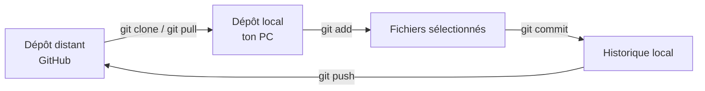

# 17.09 - Git et Workflow labo
Git est un outil qui **garde l'historique** du code. Il permet de revenir en arrière, de voir ce qui a changé et de partager le travail.

- **Dépôt (repository, « repo »)** : un dossier de projet suivi par Git.
- **Dépôt distant** : la copie du repo sur un serveur (GitHub, GitLab…).
- **Dépôt local** : une copie du repo sur l'ordinateur.
- **Commit** : une « photo » du projet à un moment donné.

## Les commandes essentielles

| Commande | À quoi ça sert |
|---|---|
| `git clone <url>` | Copier un dépôt distant sur l'ordinateur (une seule fois, au début) |
| `git status` | Voir l'état des fichiers : modifiés, sélectionnés pour le commit, non suivis |
| `git add <fichier>` | Sélectionner un fichier pour le prochain commit (`git add .` = tous les fichiers modifiés) |
| `git commit -m "message"` | Enregistrer les fichiers sélectionnés dans l'historique **local** |
| `git push` | Envoyer les commits locaux vers le dépôt distant |
| `git pull` | Récupérer les nouveautés du dépôt distant sur l'ordinateur |
| `git log` | Afficher l'historique des commits |

> [!WARNING]
> Un `commit` reste **sur l'ordinateur**. Tant que la commande `git push` n'as pas été faite, rien n'est envoyé sur le serveur.

## Le flux de travail pour les labos

```bash
git clone <url-du-repo>
cd <nom-du-repo>

(git add .)
git commit -am "Ajout de la fonction moyenne()"

git push
```



### Bonnes pratiques

- Faire des commits **petits et fréquents**, pas un seul gros commit à la fin.
- Écrire des messages **clairs** : `Correction du calcul de la moyenne` plutôt que `modif` ou `truc`.
- Toujours faire `git push` avant de quitter la salle de labo.

---

## Questions

**1. Qu'est-ce qu'un dépôt (repository) Git ?**

**2. Comment récupère-t-on un dépôt qui se trouve sur GitHub ?**

**3. Que fait la commande `git add .` ?**

**4. Qu'est-ce qu'un commit ?**

**5. J'ai fait un commit. Est-ce que l'on peut voir mon travail sur GitHub ? Pourquoi ?**

**6. Quelle est la différence entre `git push` et `git pull` ?**

**7. Comment savoir quels fichiers ont été modifiés depuis le dernier commit ?**

**9. J'ai travaillé sur le labo à la maison et fait un `push`. De retour à l'école, que dois-je faire avant de continuer ?**


# 16.09 - Introduction au cours
- Comme outils, on utilisera : 
  - Cyberlearn : https://cyberlearn.hes-so.ch/course/view.php?id=26109
  - GitHub : https://github.com/Info1-MI-2026
  - Teams : r1oyk10

### Les commandes de bases sous Linux
- `ls -la` : liste les fichiers et dossiers dans le répertoire courant
- `cd` : change de répertoire
- `pwd` : affiche le chemin du répertoire courant
- `mkdir` : crée un nouveau répertoire
- `cd ..` : remonte d'un niveau dans l'arborescence
- `rm` : supprime un fichier

Labo 0 - Installation :
https://cyberlearn.hes-so.ch/mod/resource/view.php?id=2076886

### Questions 
```bash
~
├── documents
└── info
    └── demo
        └── main.c
```

1) Quelle commande affiche la liste des fichiers d'un répertoire ? Quelle est la différence avec `ls -la` ?

2) Depuis le répertoire `~`, quelles commandes permettent d'accéder au répertoire `info`, puis de revenir au répertoire parent ?

3) Comment créer un répertoire nommé `tp1` ?

4) Qu'est-ce que la compilation, et pourquoi est-il nécessaire de compiler un programme C ?

5) Dans la commande `gcc main.c -o app`, que représente `app` ?

6) Qu'est-ce que WSL ? Que fait la commande `code .` ?

7) Depuis le répertoire `~`, sachant qu'un fichier `main.c` se trouve dans `~/info/demo/`, quelles commandes permettent de compiler puis d'exécuter le programme ?

